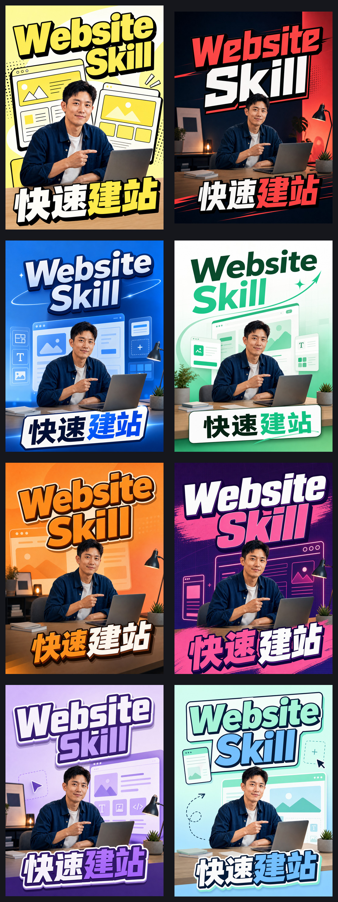

# Social Cover Layout

> **Platform-aware social cover Skill for AI Agents**  
> An open-source Agent Skill that turns a finished content brief into an original, platform-adapted cover plan or generated cover for Xiaohongshu, X/Twitter, YouTube, WeChat, Instagram, LinkedIn, TikTok, and other media surfaces.
>
> Created and maintained by **Chuluu**.

[中文说明](README.zh-CN.md) | English

[](./SKILL.md)
[](./skill.json)
[](./LICENSE)
[](https://github.com/ChuluuMGL)
[](./references/visual-routes.md)
[](./references/quality-gate.md)

[GitHub Repository](https://github.com/ChuluuMGL/social-cover-layout) | [Demo Gallery](./demo/README.md) | [Skill Definition](./SKILL.md) | [Platform Specs](./references/platform-specs.md) | [Multilingual Typesetting](./references/multilingual-typesetting.md) | [Visual Routes](./references/visual-routes.md) | [Color System](./references/color-system.md) | [Quality Gate](./references/quality-gate.md) | [Testing Matrix](./TESTING.md) | [Publishing Boundary](./PUBLISHING.md)

## 3-Minute Quick Start

```bash
git clone https://github.com/ChuluuMGL/social-cover-layout.git
cd social-cover-layout
```

Install the folder into a compatible Agent Skills directory, or point your agent at the repository root.

Invoke:

```text
Use $social-cover-layout to turn this finished Xiaohongshu brief into a 3:4 cover.
Platform: Xiaohongshu.
Topic: Content Creation Skill.
Title: 内容创作 Skill / 写笔记还能做封面。
Visual subject: a person, laptop, note card, and cover card.
Generation mode: generate.
```

The Skill can also be called by a content-production workflow after the writing brief is complete.

## Demo Preview

These are actual generated outputs from the earlier Website Skill and Content Creation Skill tests. The new [generated cross-platform demos](./demo/generated-platform-demos/) cover X, WeChat Official Account, YouTube, and Bilibili. The platform-ratio checks are kept separately in the [technical test pack](./demo/technical-platform-tests/).




See the full [Demo Gallery](./demo/README.md).

## What This Skill Does

`social-cover-layout` keeps content creation and cover production as two connected stages: it does not write the article, but receives a finished brief and turns it into a platform-specific cover system. `content-cover-router` remains the former internal name and compatibility alias.

| Output | What It Contains |
|---|---|
| Platform route | Surface, ratio, safe area, and thumbnail priority for Xiaohongshu, X/Twitter, YouTube, WeChat, Bilibili, or another media surface. |
| Visual route | `headline-first`, `proof-first`, or `bridge-hybrid` inside one `adaptive-composite` system. |
| Title system | Semantic line breaks, two-group maximum, keyword color emphasis, stable baselines, and no accidental single-character drops. |
| Layer system | Background, type-and-proof, and foreground layers with explainable person/type/object overlap. |
| Canvas families | `vertical`, `wide`, and `square` composition constraints reused across platform ratios; no template explosion. |
| Color system | Bright, soft, and two-color palettes selected by content mood and brand rules. |
| Generation brief | A prompt-ready cover specification with references, platform, ratio, title, visual anchor, and manual review items. |
| QA handoff | Readability, safe-area, asset authorization, extra-text, and layer-depth checks before publishing. |
| Multilingual typography | P0 coverage for Simplified Chinese, Traditional Chinese, English, Japanese, and Korean; other languages require manual review. |

## Use Cases

| Scenario | Typical Request |
|---|---|
| Xiaohongshu note cover | "Use the note brief to make a 3:4 cover with a bold result promise." |
| X/Twitter post image | "Adapt this idea into a square or horizontal social card with one-second comprehension." |
| YouTube thumbnail | "Make a 16:9 thumbnail with a shorter title, larger subject, and stronger contrast." |
| Instagram feed / Reel cover | "Use 4:5 for feed or 9:16 for Reels, keeping the title in the center-safe area." |
| LinkedIn share / article cover | "Use a proof-first 1.91:1 card or an editorial 10:3 article header." |
| TikTok video cover | "Use a 9:16 video-first composition with central safe-area text." |
| Tool or Skill launch | "Show the product, laptop, or interface as proof while keeping the person and title readable." |
| Content workflow handoff | "After writing the note, ask whether to route the brief to the cover Skill." |
| No-person cover | "Create a cover using a product interface, laptop, hand, type, or scene as the visual anchor." |

## Workflow

This Skill uses a purpose-led, platform-aware workflow:

| Phase | Gate | Deliverable |
|---|---|---|
| 1. Brief intake | Topic, purpose, title, platform, surface, ratio, and available references are known. | Structured cover brief |
| 2. Platform route | Surface and thumbnail behavior are explicit. | Ratio, safe area, and platform constraints |
| 3. Adaptive composite | Choose route, semantic grouping, color tokens, and layer action. | Visual system and generation prompt |
| 4. Generate or specify | Run only when the user asks for a generated image; otherwise return a prompt-ready plan. | Image or prompt package |
| 5. Quality gate | Check text, subject, evidence, safe area, extra text, and authorization. | `pass`, `revise`, or `manual-review` |

## Adaptive Composite

The Skill has one unified cover system rather than separate copied templates:

- `headline-first`: title is the first reading object for tutorials, experience, and strong hooks.
- `proof-first`: product, interface, or laptop evidence is the first proof object for tool releases.
- `bridge-hybrid`: a person carries warmth and click appeal while product evidence carries credibility. This is the default for tool and Skill launches.

The layer action is selected independently:

- `person-over-type`
- `type-over-object`
- `split-layer`

The goal is an explainable front/middle/background relationship. A person, laptop, card, or object may overlap roughly 5–12% of a title edge while preserving at least 88% title readability. Text itself must never be dropped or shifted to fake depth.

## Originality and Asset Boundary

This repository is an original implementation of general cover-production methods. It does not bundle third-party Skill text, repository structure, brand names, creator portraits, logos, watermarks, screenshots, or copied single-cover compositions.

References may be used to study general visual language such as contrast, hierarchy, safe areas, semantic line breaks, and evidence-led composition. Public examples in this repository must use original prompts, authorized assets, or synthetic references.

Generated images are separate from the Skill source. Commercial use depends on the image model's terms and on rights to any person reference, logo, screenshot, font, or other asset supplied to the generation workflow.

## Integration with Content Creation

`content-creation-workflow` may hand off a structured brief after drafting, scoring, revising, and platform adaptation:

```yaml
cover_skill: "social-cover-layout"
topic: ""
purpose: "click | save | tutorial | proof | series-recognition"
selected_title: ""
hook: ""
visual_anchor: "person | screenshot | product | laptop | hand | typography | scene"
language: ""
locale: ""
script: ""
direction: "ltr | rtl | auto"
text_mode: "controlled-typeset | model-rendered | hybrid"
font_preferences: []
break_policy: "locale-default"
platform: "xiaohongshu | x | youtube | wechat | bilibili | instagram | linkedin | tiktok | other"
surface: "note-cover | post-image | thumbnail | shorts-frame | video-cover | reel-cover | article-cover | share-card | profile-cover | image-ad"
ratio: ""
layout_family: "vertical | wide | square | auto"
generation_mode: "prompt-only | generate"
```

The handoff is optional. This repository remains usable as a standalone Skill.

## Quality Gate

Before a cover is treated as ready, check:

- Correct platform ratio and delivery surface.
- Main title and visual anchor remain recognizable at a lightweight 25% thumbnail preview, with no wrong characters or unrequested text.
- Face, hands, product, evidence, and title inside the safe area.
- No unauthorized person, logo, screenshot, font, watermark, or third-party brand.
- No accidental character drop, floating glyph, or random line break.
- Reading order is clear and the layer relationship is explainable.
- Decorative elements do not overpower the title or visual anchor.

See [`references/quality-gate.md`](./references/quality-gate.md) for the full checklist.

## Validation

```bash
npm run validate
```

This validates the frontmatter, required references, JSON metadata, README links, and the standalone package shape. Visual output still requires human review at thumbnail size.

## License

MIT. See [`LICENSE`](./LICENSE).

The MIT license covers this repository's source and documentation. It does not grant rights to external images, fonts, logos, screenshots, model outputs, or third-party references supplied by a user.
