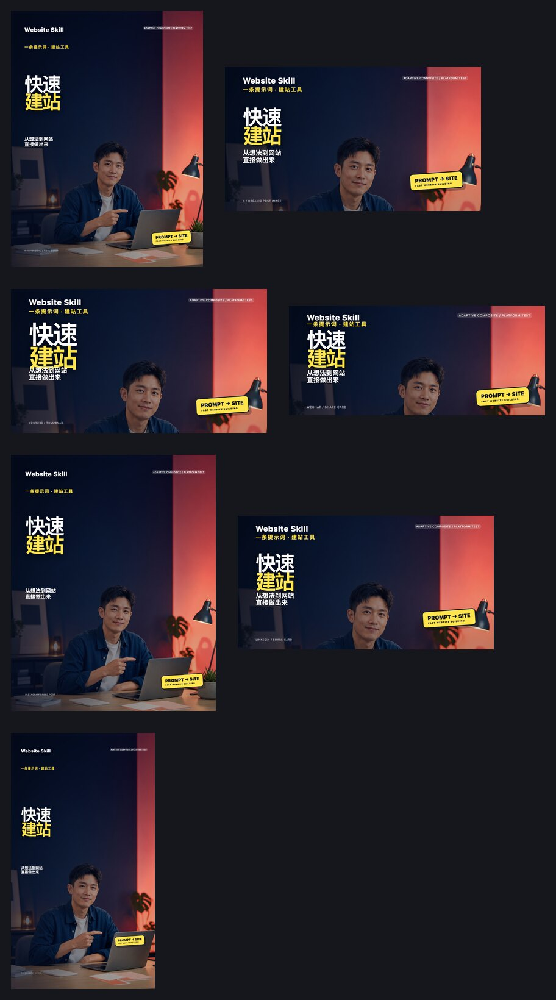

# Demo gallery

These are real outputs from the cover tests that led to the current `social-cover-layout` rules.

The platform pack uses one `Website Skill / 快速建站` brief and recomposes it for each surface. The images are a deterministic layout and safe-area demonstration, so they should not be described as seven independent image-model generations.

## Cross-platform pack

| Surface | Canvas | File |
| --- | ---: | --- |
| Xiaohongshu note cover | 1080×1440 | [xiaohongshu-3x4-1080x1440.png](./platform-tests/xiaohongshu-3x4-1080x1440.png) |
| X organic post image | 1200×675 | [x-organic-16x9-1200x675.png](./platform-tests/x-organic-16x9-1200x675.png) |
| YouTube thumbnail | 1280×720 | [youtube-16x9-1280x720.png](./platform-tests/youtube-16x9-1280x720.png) |
| WeChat share card | 900×383 | [wechat-share-21x9-900x383.png](./platform-tests/wechat-share-21x9-900x383.png) |
| Instagram feed post | 1080×1350 | [instagram-feed-4x5-1080x1350.png](./platform-tests/instagram-feed-4x5-1080x1350.png) |
| LinkedIn share card | 1200×627 | [linkedin-share-191x1-1200x627.png](./platform-tests/linkedin-share-191x1-1200x627.png) |
| TikTok video cover | 1080×1920 | [tiktok-video-9x16-1080x1920.png](./platform-tests/tiktok-video-9x16-1080x1920.png) |

## Earlier case tests

These are the earlier two test cases used while merging the `Mengxiao` and `Segawa/Atun` strengths into one original adaptive-composite system:

- [Website Skill — sunny yellow](./previous-cases/website-skill-sunny-yellow.png)
- [Website Skill — 10 palette contact sheet](./previous-cases/website-skill-10-palettes.jpg)
- [Content Creation Skill — actual adaptive-composite test](./previous-cases/content-creation-skill-yellow.png)

The images show the result of the test process, not a promise of performance, click-through rate, or platform acceptance. Final publishing still requires checking the current platform uploader and any rights for people, logos, screenshots, fonts, or model outputs.
