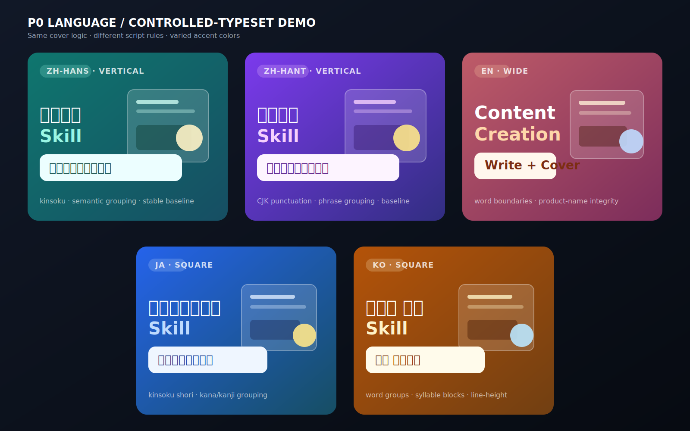

# P0 multilingual demos

This is a controlled-typeset typography demo for the five P0 languages currently covered by the Skill:

- Simplified Chinese (`zh-Hans`)
- Traditional Chinese (`zh-Hant`)
- English (`en`)
- Japanese (`ja`)
- Korean (`ko`)

The panels intentionally use different accent colors, but color is not the variable being tested. The demo shows semantic line grouping, stable baselines, script-appropriate punctuation, and the same layered cover logic across languages.

This is a typography and layout QA specimen, not five independent image-model generations. It demonstrates the `controlled-typeset` path used when the title must be exact. The generated platform examples remain in [`../generated-platform-demos/`](../generated-platform-demos/).

| Language | Title grouping | Text mode | Layout family |
|---|---|---|---|
| Simplified Chinese | `内容创作 Skill` / `写作与封面一次完成` | `controlled-typeset` | `vertical` |
| Traditional Chinese | `內容創作 Skill` / `寫作與封面一次完成` | `controlled-typeset` | `vertical` |
| English | `Content Creation Skill` / `Write + Cover` | `hybrid` | `wide` |
| Japanese | `コンテンツ制作 Skill` / `書いて表紙も完成` | `controlled-typeset` | `square` |
| Korean | `콘텐츠 제작 Skill` / `쓰고 커버까지` | `controlled-typeset` | `square` |
